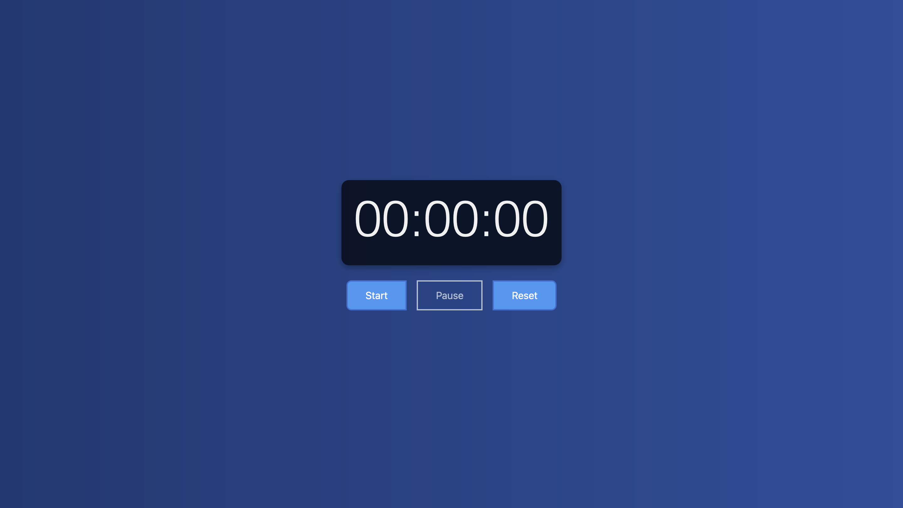

# Stopwatch Application

A beautifully designed and fully functional stopwatch application built using React. This application allows you to start, pause, and reset a timer with a user-friendly interface. The stopwatch is designed to be responsive, featuring custom buttons and a visually appealing layout to enhance user experience.

### [Live Demo](https://stop-watch-mzqj28gop-faisal-khans-projects-3511e148.vercel.app/)

## Features

- **Start, Pause, and Reset Timer**: Easily control the stopwatch with intuitive buttons.
- **Responsive Design**: The stopwatch is fully responsive, ensuring a great experience on both desktop and mobile devices.

## Screenshots



## Tech Stack

- **React**: JavaScript library for building user interfaces.
- **CSS**: Custom styles for a clean and modern look.
- **Vercel**: Hosting and deployment.

## Installation

If you'd like to run the stopwatch application locally, follow these steps:

1. **Clone the repository:**
   ```bash
   git clone https://github.com/yourusername/stopwatch-app.git
   ```
2. **Navigate to the project directory:**

   ```bash
   cd stopwatch-app
   ```

3. **Install dependencies:**

   ```bash
   npm install
   ```

4. **Start the development server:**
   ```bash
   npm run dev
   ```
   Your application should now be running on `http://localhost:3000`.

## Usage

- **Start the Timer**: Click the "Start" button to begin the stopwatch.
- **Pause the Timer**: Click the "Pause" button to pause the stopwatch.
- **Reset the Timer**: Click the "Reset" button to reset the stopwatch back to `00:00`.

## Deployment

This application is deployed on Vercel for quick access and ease of use. To deploy your own version:

1. Push your code to a GitHub repository.
2. Import the repository on Vercel.
3. Deploy the project with default settings. Vercel automatically handles build and deployment.
